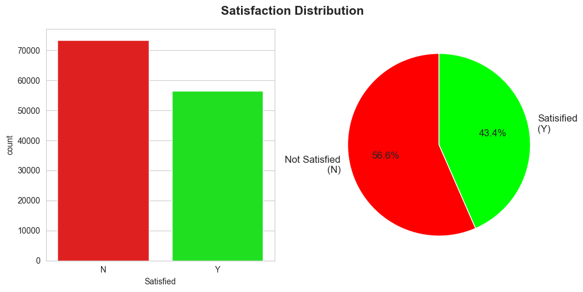
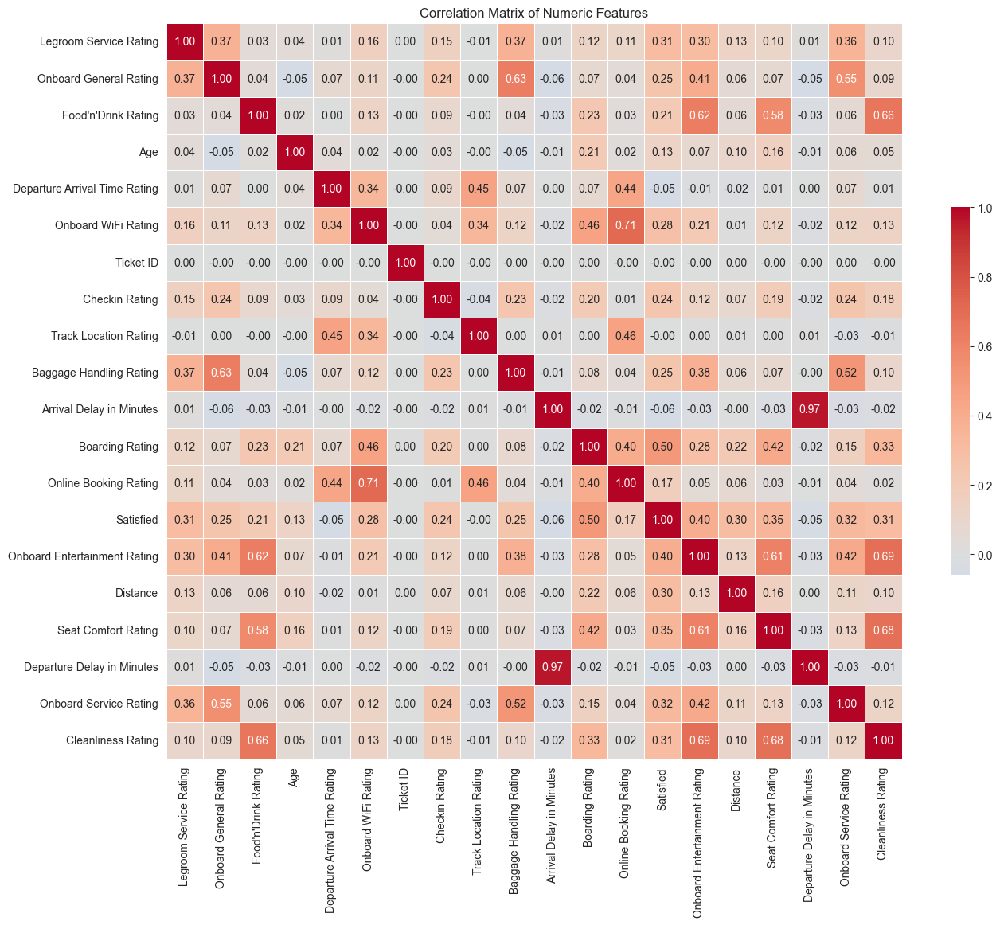

# **Trains - Artificial Intelligence and Machine Learning Project**🚆
## Group Members

Pierpaolo Ceccarelli 284451

Andrea Contino 284471

Piergiorgio Zannella 284951

## Introduction🚂

Our project aims at augmenting the prediction of customer satisfaction for the ThomasTrain Company by integrating machine learinig and data science techniques with customer service insights. Our project dives into the "trains.csv" dataset, which encompasses a variety of variables including demographic details, travel information, and service ratings. The primary objective is to deduce customer satisfaction levels indirectly through analysis of the data, as opposed to relying solely on direct customer feedback, to effectively target users with promotions and making the retention higher.

In the initial phase, we conducted an exploratory data analysis (EDA) to unearth trends and interconnections within the data. To prepare the dataset for effective machine learning modeling, we undertook several preprocessing steps such as filling in missing values, converting categorical data into a usable format, and eliminating data outliers. 

Our aim was to construct machine learning models that could accurately categorize customers into "satisfied" or "unsatisfied" groups, to grasp the nuanced factors influencing customer satisfaction. This was achieved through a combination of data preprocessing, analysis, and the application of machine learning techniques.

## Methods 🔍

In this section, we outline the methods used for our project. Our approach involved a blend of data handling, visualization, and machine learning techniques.

- First we conducted Exploratory Data Analysis (EDA) to take a look at our data features and properties. We started with the basics, utilizing Pandas for managing our dataset, for visualization we turned to Matplotlib and Seaborn, essential  for designing plots and statistical graphs. After loading our dataset into a Pandas DataFrame, we took a look into its structure. This step was crucial for setting up our subsequent analysis and to have a general understanding of the distributions. 

- We graphed the distribution of categorical features among which the target variable “Satisfied”, through histograms and pie charts to give us insights into the distribution of this type of data. 

- Then we dove into the dataset by looking at its shape, data types, missing values, and unique values. This comprehensive overview helped us in tailoring our preprocessing strategies, for instance in the decision to remove or integrate the Nan values.

- The categorical 'Satisfied' column was encoded into numerical values (0 and 1), a necessary step for the classification models we intended to use. 

- Then we plotted a correlation heatmap to get the most correlated features to our target variable. It helped us pinpoint which variables might be key players. 

After completing the EDA and correlation analysis we started to process our data to fit into the models.

- First using a threshold we removed some features that had a really low correlation with the target variable and removed the target variable from the data.

- Then through the use of a model pipeline we made sure that the categorical data where encoded and we scaled all the data to be evenly usable for training.

- We than 

## Experimental Design ✒️

Describe any experiments you conducted to 
demonstrate/validate the target contribution(s) of your project; indicate the 
following for each experiment: 
• The main purpose: 1-2 sentence high-level explanation 
• Baseline(s): describe the method(s) that you used to compare your work 
to 
• Evaluation Metrics(s): which ones did you use and why?

## Results 📑

Describe the following: 
• Main finding(s): report your final results and what you might conclude 
from your work 
• Include at least one placeholder figure and/or table for communicating 
your findings 
• All the figures containing results should be generated from the code

## Conclusions 💡

List some concluding remarks. In particular: 
• Summarize in one paragraph the take-away point from your work. 
• Include one paragraph to explain what questions may not be fully 
answered by your work as well as natural next steps for this direction of 
future work
